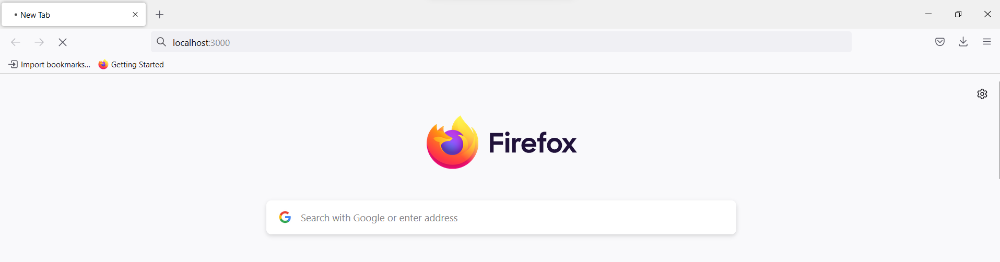
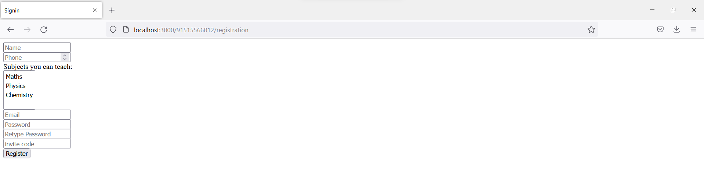
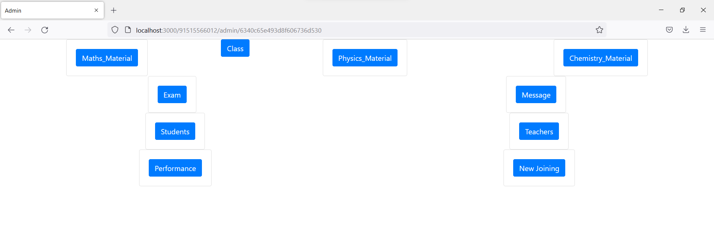
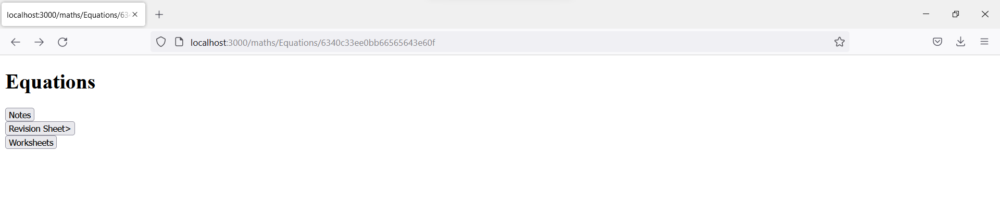
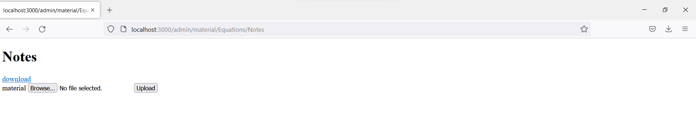
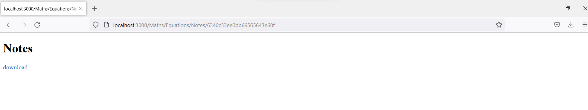
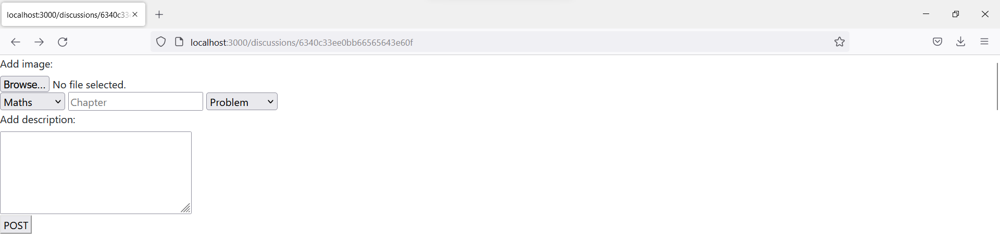

# Educational_Website
<!-- PROJECT SHIELDS -->
<!--
*** I'm using markdown "reference style" links for readability.
*** Reference links are enclosed in brackets [ ] instead of parentheses ( ).
*** See the bottom of this document for the declaration of the reference variables
*** for contributors-url, forks-url, etc. This is an optional, concise syntax you may use.
*** https://www.markdownguide.org/basic-syntax/#reference-style-links
-->

<!-- GETTING STARTED -->
## Getting Started

To setting up the project locally
To get a local copy up and running follow these simple example steps.

### Setting up the database
Running the the MongoDB data base.
  ```sh
  mongod
  ```
Note:Keep the mongod server running

### Setting up the Server

Use this command in a sepreate temrinal to start the server.
  ```sh
  Node app.js
  ```
Note:If the server runs into a problem restart the server with the same command.
<!-- USAGE EXAMPLES -->
## Usage
  <ol>
    <li>
        Open your web browser and connect to localhost:3000/91515566012(Admin Portal)
      
      <br>
    </li>
    <li>
      You will be redirected to signin page. Click on register.
      <br>
      
    </li>
    <li>
      Enter your credentials, with a password. And click on register and you will be redirected to sign in page.
      Sign in with appropriate credentials and you will be redirected to Admin homepage.
      <br>
         
      <br>
    </li>
      Select the subject, navigate to the desired chapter, select one of the options from Notes, Worksheets, Revision
      And you will see the download links of the files uploaded and an option to upload new files
  <br>
         
  <br>
       
  <br>
      If you get dine message you have successfully uploaded the file, now you can go back and check for the new file.
      Note:Dont give spacess in the file name
    <li>
      Now connect as a student to localhost:3000
      <br>
      
      <br>
    </li>
    <li>
      You will be redirected to signin page. Click on register.
      <br>
      
      <br>
    </li>
    <li>
      Enter your credentials, with a password. And click on register and you will be redirected to sign in page.
      Sign in with appropriate credentials and you will be redirected to homepage.
      <br>
         
      <br>
    </li>
  
    <li>
      Select the subject, navigate to the desired chapter, select one of the options from Notes, Worksheets, Revision
      And you will see the download links of the files uploaded.  
      <br>
         
      <br>
    </li>
    <li>
      Discussions:
      In the home page, select the discussions button, you will be redirected to discussions page.
      <br>
      
      <br>
      fill in the inputs and click post.
      click look up to look up other doubts.
      Note:Delete, answering, image display is not implemented.
    </li>
  </ol>
